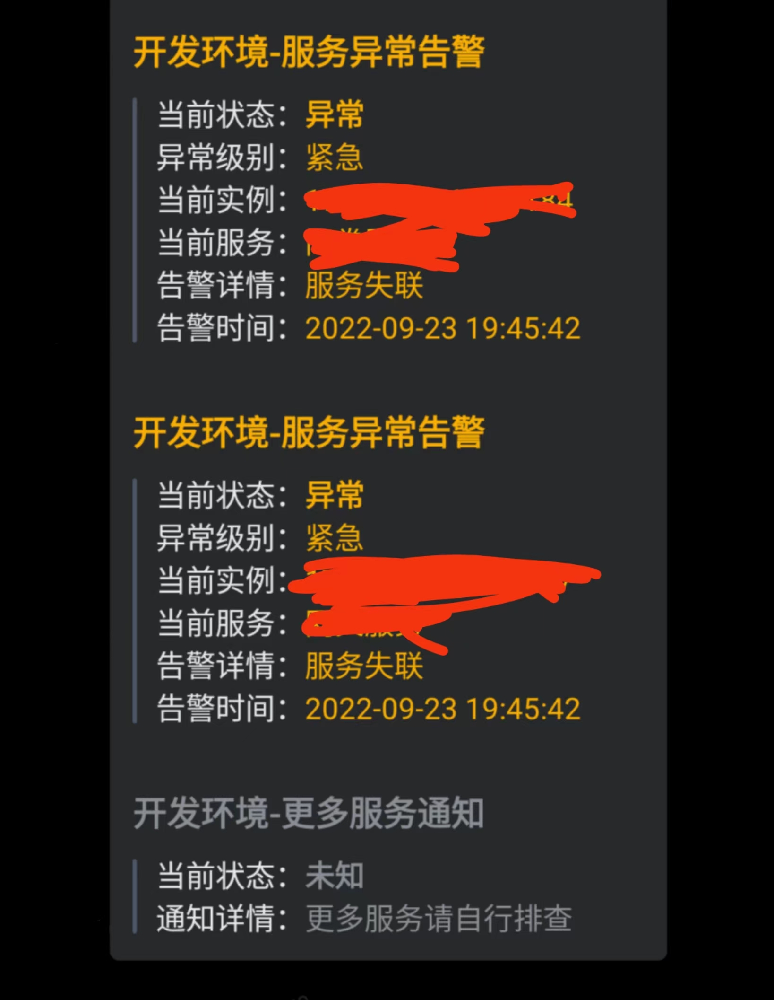
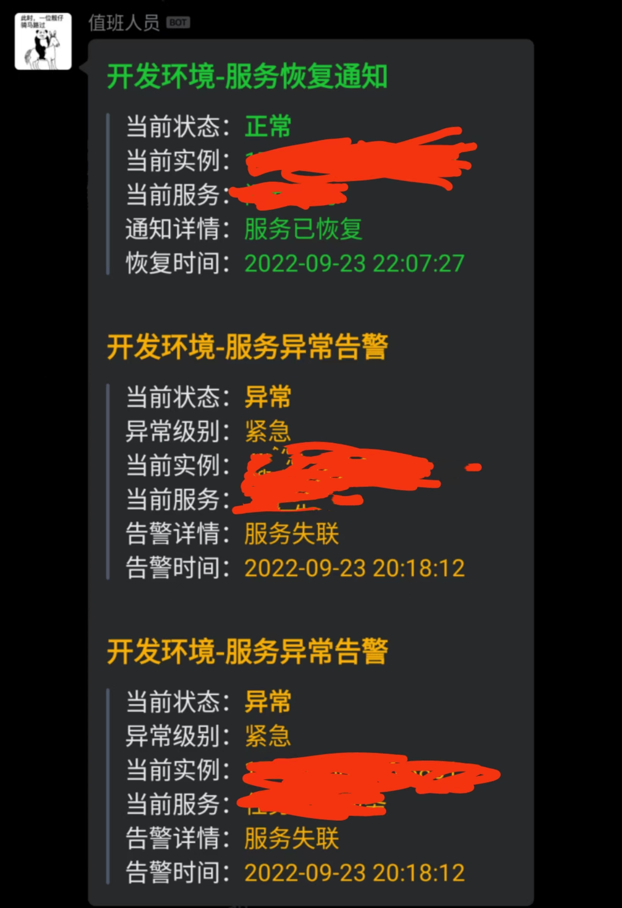

# 概述

prometheus alert-manager接入企业微信机器人通知,使用Docker部署,webhook地址http://host:port/webhook;使用HOOK_KEY绑定自己的机器人key.

### 快速开始

```shell
docker run --name wecomhook -e HOOK_KEY=yours -p 6666:6666 -d mysteriousman/prometheus-wecom-webhook:0.1
```


### 构建镜像

```shell
docker build --network host -t wecomhook:0.1 .
```

### 清理环境

```shell
docker image prune --filter label=stage=builder
```

### 本地打包镜像

```shell
docker save wecomhook:0.1 > wecomhook.tar
```

### 线上导入镜像

```shell
docker load < wecomhook.tar
```

### 启动容器

```shell
docker run --name wecomhook -e HOOK_KEY=yours -p 6666:6666 -d wecomhook:0.1
```

### 最终效果

